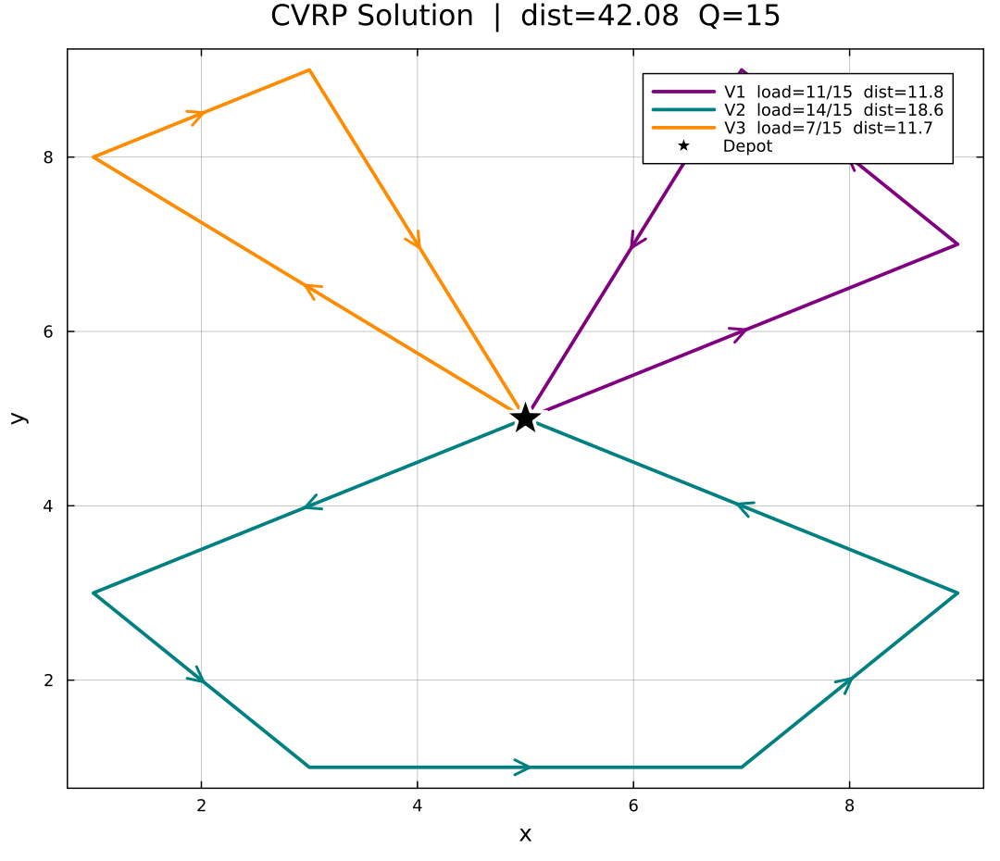

# Julia VRP Optimization

Step-by-step MILP implementation of vehicle routing in Julia/JuMP,
progressing from a basic LP through TSP to a full Capacitated
Vehicle Routing Problem (CVRP), with experimental analysis.



## Formulation

This project implements the **CVRP as a compact MILP** using
**Miller-Tucker-Zemlin (MTZ)** load variables for simultaneous
subtour elimination and capacity enforcement.

**Decision variables:**
- `x[i,j,k] ∈ {0,1}` — 1 if vehicle k travels arc i→j
- `load[i,k] ∈ [0,Q]` — cumulative load on vehicle k after node i

**Objective:** minimize total travel distance across all vehicles.

**Key constraints:**
- Each customer visited by exactly one vehicle
- Flow conservation at every customer node
- Load propagation via big-M (enforces capacity + eliminates subtours)
- Vehicles may stay idle (`<= 1` depot constraint) — solver uses
  only as many vehicles as needed

## Known limitations

The MTZ formulation produces a **weak LP relaxation** — the
integrality gap grows with instance size, making this approach
impractical beyond ~20–30 nodes. This motivates the use of
decomposition methods such as **branch-and-price** and
**column generation**, which are central to state-of-the-art
exact VRP solvers.

## Solution output

Running `include("run.jl")` solves the default instance
(9 nodes, K=3 vehicles, Q=15) and saves the route plot automatically:

```julia
julia> include("run.jl")
Status:         OPTIMAL
Total distance: 42.082
Vehicle 1: 1 → 5 → 4 → 1  |  demand=11/15  |  dist=11.77
Vehicle 2: 1 → 9 → 8 → 7 → 6 → 1  |  demand=14/15  |  dist=18.6
Vehicle 3: 1 → 2 → 3 → 1  |  demand=7/15  |  dist=11.71
Saved → cvrp_solution.png
```

- Vehicle 2 consolidates the heaviest cluster (nodes 6–9, demand=14)
  into one efficient loop
- Vehicles 1 and 3 handle the lighter northern clusters
- All capacity constraints satisfied (max load 14/15)

## Experimental results

Increasing vehicle capacity reduces route fragmentation and total
travel cost. As Q grows, fewer vehicles are needed to cover
total demand (Σd = 32 across 8 customers).

```julia
julia> include("experiments/capacity_experiment.jl")
Q       | Vehicles used | Total distance | Avg route demand
------------------------------------------------------------
8       | 4             | 63.82          | 8.0
10      | 4             | 49.37          | 8.0
12      | 3             | 43.73          | 10.7
15      | 3             | 42.08          | 10.7
20      | 2             | 37.14          | 16.0
```

**Key observations:**
- At Q=8: minimum 4 vehicles required (⌈32/8⌉ = 4), each serving
  ~2 customers with costly depot round-trips
- At Q=12: solver consolidates to 3 vehicles, saving 20.09 distance units
  vs Q=8 (31% reduction)
- At Q=20: 2 vehicles suffice (⌈32/20⌉ = 2), each serving ~4 customers
  with far fewer depot returns
- Distance reduction is driven by **fewer depot round-trips** —
  every vehicle consolidation eliminates two long depot-to-cluster legs

## Project structure

| File | Purpose |
|---|---|
| `src/data.jl` | Instance definition and distance matrix |
| `src/model.jl` | MILP formulation with full mathematical comments |
| `src/solve.jl` | Solver execution and solution extraction |
| `src/visualize.jl` | Automatic route plotting with Plots.jl |
| `experiments/capacity_experiment.jl` | Capacity sensitivity analysis |
| `run.jl` | Single entry point — solves and plots automatically |

## How to run

**1. Install Julia** from [julialang.org](https://julialang.org/downloads/)

**2. Clone or download this repo**, open Julia in the project folder:

```julia
using Pkg
Pkg.activate(".")
Pkg.instantiate()   # installs JuMP, HiGHS, Plots automatically
```

**3. Run the main solution:**

```julia
include("run.jl")
```

**4. Run the capacity experiment:**

```julia
include("experiments/capacity_experiment.jl")
```

**5. Generate plots for different capacities:**

```julia
for Q in [8, 12, 15, 20]
    inst = Data.CVRPInstance(
        [(5,5),(1,8),(3,9),(7,9),(9,7),(9,3),(7,1),(3,1),(1,3)],
        [0,3,4,5,6,4,3,5,2], 4, Q)
    sol = Solve.solve_cvrp(inst, VRPModel.build_model; silent=true)
    Visualize.plot_cvrp(inst, sol; save_path="cvrp_Q$(Q).png")
end
```

## Common Julia gotcha

Assigning to a variable inside a `for` loop at top level triggers
a soft-scope warning if a global with the same name exists. Fix
with `let` blocks — see `experiments/capacity_experiment.jl` and
`src/solve.jl` for working examples. This also applies to tour
extraction loops in `src/solve.jl`.

## Future work

- **Column generation / branch-and-price** for large instances
- **Time window constraints** (VRPTW)
- **Benchmark datasets** (Solomon instances, CVRPLIB)
- **Heterogeneous fleet** with vehicle-specific capacities

## Dependencies

- [JuMP.jl](https://jump.dev) — algebraic modeling language
- [HiGHS.jl](https://github.com/jump-dev/HiGHS.jl) — free MIP solver
- [Plots.jl](https://docs.juliaplots.org) — visualization
